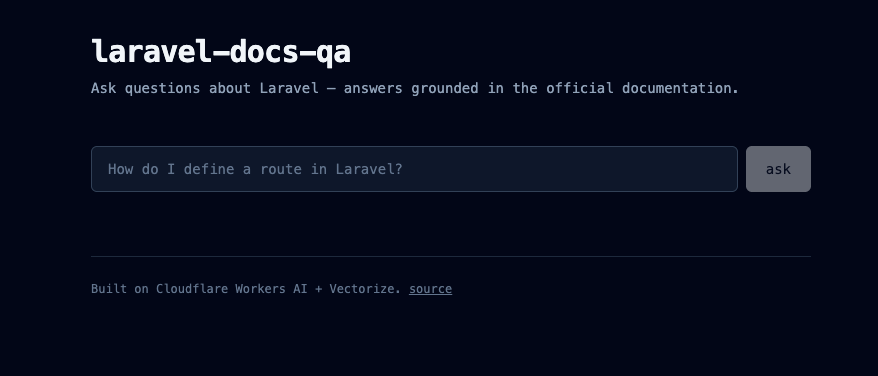

# Laravel Docs Q&A

A production-grade RAG (Retrieval-Augmented Generation) chatbot built entirely on the Cloudflare stack. Answers questions about the Laravel PHP framework using its official documentation as the knowledge source, with cited sources.

**Live demo:** [laravel-docs-qa-frontend.pages.dev](https://laravel-docs-qa-frontend.pages.dev/) ↗



## What it does

Type a natural-language question and receive a streamed AI answer with citations linking back to Laravel's official documentation. The frontend lives on Cloudflare Pages; a Pages Functions proxy forwards requests to a Cloudflare Worker that runs the RAG pipeline.

The API can also be called directly:

```bash
curl -X POST https://YOUR-WORKER-URL/api/ask \
  -H "Authorization: Bearer YOUR_TOKEN" \
  -H "Content-Type: application/json" \
  -d '{"question":"How do I define a route in Laravel?"}' \
  -N
```

The response is streamed via Server-Sent Events. Source URLs are returned in the `X-Sources` response header. The Worker URL and access token are available on request.

## Architecture

```
Browser
  │ POST /api/ask
  ▼
┌─────────────────────────────────────────────┐
│   Cloudflare Pages                          │
│     - Vue 3 UI (Vite + Tailwind v4)         │
│     - Pages Functions proxy:                │
│        adds Bearer token (server-side env)  │
│        forwards stream to Worker            │
└──────┬──────────────────────────────────────┘
       │ POST /api/ask + Bearer token
       ▼
┌─────────────────────────────────────────────┐
│   Cloudflare Worker (Hono)                  │
│                                             │
│   1. Auth check (Bearer token)              │
│   2. Rate limit check (Durable Object)      │
│   3. Embed question via Workers AI          │
│   4. Query Vectorize (top-5)                │
│   5. Build prompt with retrieved context    │
│   6. Stream LLM response (Llama 3.1)        │
│   7. Fire-and-forget D1 logging             │
└──────┬──────────────────────────────────────┘
       │
   ┌───┴─────┬──────────┬──────────┬──────────┐
   ▼         ▼          ▼          ▼          ▼
┌────────┐ ┌─────────┐ ┌────────┐ ┌────────┐ ┌─────────┐
│Workers │ │Vectorize│ │Workers │ │  D1    │ │Durable  │
│  AI    │ │ (768-d) │ │  AI    │ │(query  │ │Object   │
│(BGE)   │ │ cosine  │ │(Llama) │ │ logs)  │ │(rate    │
│        │ │         │ │        │ │        │ │ limits) │
└────────┘ └─────────┘ └────────┘ └────────┘ └─────────┘
  embed     retrieve    generate    audit     20/IP/hr
```

Everything runs on Cloudflare's free tier. No external services (no OpenAI, no Pinecone, no third-party hosting). The frontend repo is separate: [laravel-docs-qa-frontend](https://github.com/Cilkotron/laravel-docs-qa-frontend).

## Tech stack

**Worker:**
- Cloudflare Workers (TypeScript)
- [Hono](https://hono.dev/) — lightweight edge-native web framework
- Workers AI, Vectorize, D1, and Durable Object bindings

**AI models (both via Workers AI):**
- Embeddings: `@cf/baai/bge-base-en-v1.5` (768 dimensions)
- LLM: `@cf/meta/llama-3.1-8b-instruct` (streaming responses)

**Storage and state:**
- Vectorize — vector index, 2,366 chunks, cosine similarity
- D1 — SQLite database for query logging (analytics, debug)
- Durable Object with SQLite backend — per-IP rate limiting

**Frontend:**
- Vue 3 (Options API) + TypeScript
- Vite + Tailwind v4
- Deployed on Cloudflare Pages with Functions proxy

**Knowledge base:**
- Source: [laravel/docs](https://github.com/laravel/docs) (branch `13.x`)
- 103 markdown files
- 2,366 chunks indexed in Vectorize
- ~500 words per chunk with 50-word overlap

**Ingest pipeline (local, Python):**
- `sentence-transformers` for local embedding generation
- `markdown-it-py` for parsing
- `gitpython` for cloning the docs repo
- Vectors uploaded to Vectorize via Wrangler CLI

## How retrieval works

Each chunk in the knowledge base carries metadata: original file, section headings (H1/H2/H3), source URL on laravel.com. When a question comes in:

1. **Auth check** — Bearer token must match the value stored as a Worker Secret.
2. **Rate limit check** — a Durable Object keyed by hashed IP enforces 20 requests per hour with a sliding window. Returns 429 with `Retry-After` if exceeded.
3. **Embed** — the question is converted to a 768-dimensional vector using the same embedding model as the indexed chunks (consistency matters — different models produce incompatible vector spaces).
4. **Retrieve** — Vectorize returns the top-5 chunks ranked by cosine similarity.
5. **Generate** — retrieved chunks are formatted as numbered sources and inserted into the LLM prompt. The model is instructed to answer only from the provided context and cite sources using `[Source N]` notation.
6. **Stream** — the LLM response streams back as Server-Sent Events. Source URLs ride along in the `X-Sources` response header.
7. **Log** — a fire-and-forget write to D1 records the query, latency, source count, and a hashed IP. Uses `ctx.waitUntil()` so logging never blocks the response.

## Why this stack

A few decisions worth noting:

**Why local embedding for ingest rather than Workers AI?**
Workers AI free tier is 10,000 neurons/day. Embedding 2,366 chunks would consume most of that budget on initial indexing alone, and re-indexing would force paid usage. Local embeddings using `sentence-transformers` are free and reproducible.

**Why the same model for query-time embedding?**
Cross-model vector compatibility is unreliable. Using `BAAI/bge-base-en-v1.5` consistently — locally for ingest, on Workers AI for queries — guarantees vectors live in the same semantic space.

**Why Hono over vanilla Workers?**
Routing, middleware, and type-safe bindings out of the box. Single-handler vanilla Workers code becomes painful past two endpoints; Hono adds ~12KB and saves significant boilerplate.

**Why Durable Objects over KV for rate limiting?**
KV has eventual consistency (up to 60 seconds globally) and a 1,000 writes/day free-tier ceiling — both fatal for rate limiting. Durable Objects with SQLite backend give strong per-instance consistency, atomic increments, and a much higher free-tier budget. The `idFromName(ipHash)` pattern routes every request from a given IP to the same DO instance.

**Why a Pages Functions proxy in front of the Worker?**
The Worker requires Bearer authentication. If the frontend held the token directly, it would be exposed in the browser (any client-side env var is public after build). The Pages Functions proxy holds the token server-side and injects it on every request, so the browser never sees it. This is the same public-private split used in production SaaS apps.

**Why hash the IP?**
Logs and rate-limit state never store raw IPs. A SHA-256 truncated to 16 hex chars is enough to uniquely group requests without retaining personally identifiable network data.

**Why cosine similarity over dot product?**
The BGE model produces normalized embeddings, so cosine and dot product are equivalent in ranking. Cosine is chosen for clarity — it's the default mental model when discussing semantic similarity.

**Why fire-and-forget logging?**
`ctx.waitUntil()` lets D1 writes finish after the response has already been sent to the client. The user never waits for analytics.

## Project structure

```
laravel-docs-qa/
├── src/
│   ├── index.ts                       # Hono app, auth middleware, routes
│   ├── bindings/
│   │   └── env.ts                     # Type definitions for Worker bindings
│   ├── lib/
│   │   └── logger.ts                  # D1 logging + IP hashing helpers
│   └── durable_objects/
│       └── rate_limiter.ts            # Per-IP rate limiter (SQLite-backed DO)
├── migrations/
│   └── 0001_create_queries.sql        # D1 schema
├── ingest/
│   ├── clone_docs.py                  # Clone laravel/docs repo
│   ├── chunk_docs.py                  # Parse markdown, chunk with metadata
│   ├── embed_chunks.py                # Generate embeddings locally
│   ├── prepare_for_vectorize.py       # Convert to Vectorize NDJSON format
│   ├── test_search.py                 # CLI smoke test for Vectorize search
│   └── requirements.txt
├── docs/
│   └── screenshot.png                 # Demo screenshot used in this README
├── wrangler.jsonc                     # Worker config with all bindings
├── package.json
└── tsconfig.json
```

## Running locally

### Prerequisites
- Node.js 20+
- Python 3.12+
- Cloudflare account with Workers AI enabled
- Wrangler authenticated (`npx wrangler login`)

### One-time setup

**Worker dependencies:**
```bash
npm install
```

**Ingest pipeline dependencies:**
```bash
cd ingest
python -m venv venv
source venv/bin/activate
pip install -r requirements.txt
```

### Build the knowledge base

```bash
# From ingest/ with venv active:
python clone_docs.py            # Clone Laravel docs (~30 seconds)
python chunk_docs.py            # Split into chunks (~3 seconds)
python embed_chunks.py          # Generate embeddings (~8 minutes on CPU)
python prepare_for_vectorize.py # Convert to Vectorize format (~2 seconds)
```

### Create Vectorize index and upload vectors

```bash
# From project root:
npx wrangler vectorize create laravel-docs --dimensions=768 --metric=cosine

npx wrangler vectorize insert laravel-docs \
  --file=ingest/vectorize_upload.ndjson \
  --batch-size=1000
```

### Create D1 database and run migration

```bash
npx wrangler d1 create laravel-docs-qa
# Copy the database_id into wrangler.jsonc under d1_databases

npx wrangler d1 execute laravel-docs-qa \
  --file=migrations/0001_create_queries.sql \
  --remote
```

### Set the API token

```bash
# Generate a random token
openssl rand -base64 32

# Store it as a Worker Secret
npx wrangler secret put API_TOKEN
# Paste the token when prompted

# For local dev, also create .dev.vars in project root:
echo "API_TOKEN=your-token-here" > .dev.vars
```

### Run the Worker

**Locally:**
```bash
npx wrangler dev
# Test:
curl -X POST http://localhost:8787/api/ask \
  -H "Authorization: Bearer YOUR_TOKEN" \
  -H "Content-Type: application/json" \
  -d '{"question":"How do I define a route?"}' \
  -N
```

**Deploy to Cloudflare:**
```bash
npx wrangler deploy
```

## API

### `GET /health`

Public endpoint. Returns Worker status. No auth required.

**Response:**
```json
{
  "status": "ok",
  "timestamp": 1747824000000
}
```

### `POST /api/ask`

Protected endpoint. Requires `Authorization: Bearer <token>` header and is subject to rate limiting.

**Request:**
```json
{
  "question": "How do I define a route in Laravel?"
}
```

Constraints:
- `question` is required, non-empty, max 500 characters.

**Response:** `text/event-stream` (Server-Sent Events).

Each event is a JSON chunk with a `response` field carrying the next piece of the LLM output. The stream ends with `data: [DONE]`.

Source URLs for the retrieved context are returned in the `X-Sources` response header as a JSON array.

**Error responses:**
- `400` — missing/invalid question
- `401` — missing or invalid Bearer token
- `404` — no relevant context found in knowledge base
- `429` — rate limit exceeded (includes `Retry-After` header)
- `500` — embedding or LLM failure

## Observability

Every successful request writes a row to D1 with:
- Question text
- Latency in milliseconds
- Number of sources retrieved
- Hashed IP (SHA-256, truncated)
- Timestamp

Useful queries:

```bash
# Recent queries:
npx wrangler d1 execute laravel-docs-qa --remote --command="
  SELECT question, latency_ms, num_sources,
         datetime(created_at/1000, 'unixepoch') as ts
  FROM queries ORDER BY created_at DESC LIMIT 20"

# Latency stats:
npx wrangler d1 execute laravel-docs-qa --remote --command="
  SELECT
    COUNT(*) as total,
    AVG(latency_ms) as avg_ms,
    MIN(latency_ms) as min_ms,
    MAX(latency_ms) as max_ms
  FROM queries"
```

## Cost notes

At rest, the entire system runs on Cloudflare free tier:
- Workers: free (100K requests/day)
- Workers AI: 10K neurons/day (≈ 100–300 question answers)
- Vectorize: 5M stored vectors free (we use 2,366)
- D1: 5GB storage, 25M reads/day, 50K writes/day
- Durable Objects: 1M requests/month, sufficient for the rate limiter

For 1K queries/day in production, the bottleneck would be Workers AI neurons (~$5/month on the Workers Paid plan), not infrastructure.

## License

MIT